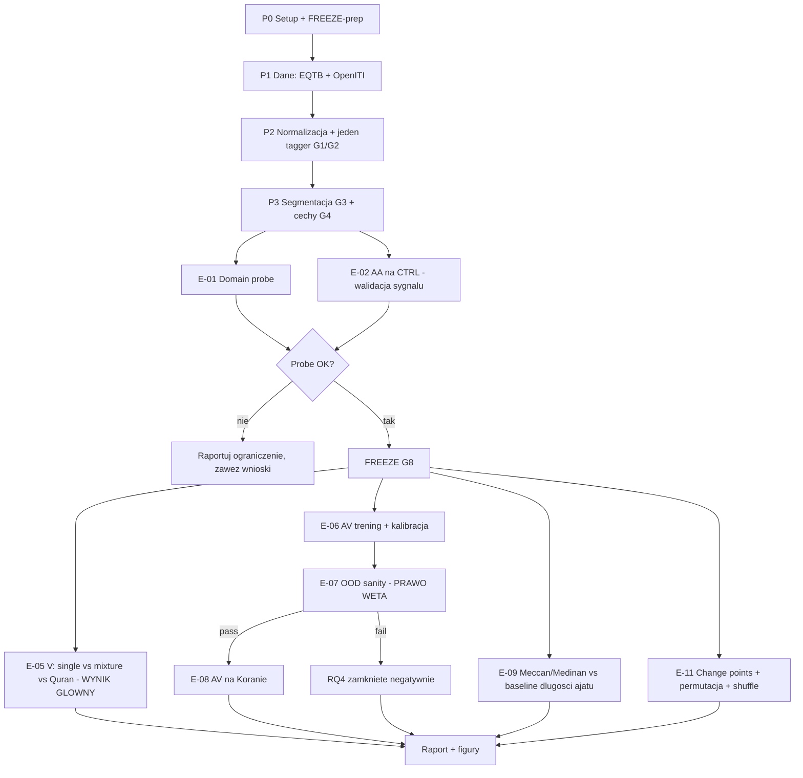

# 02 — Poprawiony design badawczy

## 1. Co dokładnie mierzymy (estymand)

Nie mierzymy „autorstwa”. Mierzymy jedną wielkość i lokalizujemy ją względem
dwóch jawnych rozkładów odniesienia.

> **V(C, R, s)** — wewnętrzna zmienność stylistyczna korpusu `C`, w
> reprezentacji `R`, przy protokole segmentacji `s`.

Definicja operacyjna (dwa estymatory, oba raportowane):

- `V_med(C)` = mediana dystansów parowych między oknami `C`, w metryce
  właściwej dla `R` (domyślnie Cosine Delta).
- `V_disp(C)` = średni dystans okna do centroidu `C` (dyspersja wokół środka).

Wymóg porównywalności (**G6**): `V` liczymy zawsze na podpróbce o **identycznej
liczbie okien `n_w` i identycznym rozkładzie długości okien** we wszystkich
korpusach; `B = 200` losowań; raportujemy medianę i 95% przedział z tych losowań.

## 2. Skala odniesienia — cztery kotwice

| Kotwica | Definicja | Oczekiwana rola |
|---|---|---|
| `V_within-surah` | dwie połowy tej samej długiej sury | dolny floor szumu pomiaru |
| `V_single` | PSEUDO-BOOK: jeden autor, wiele dzieł, rozmiar = Koran | rozkład zerowy H0 |
| `V_mixture-k` | MIXTURE: k autorów wymieszanych do rozmiaru Koranu, k∈{2,3,5} | rozkład alternatywny H1 |
| `V_multivoice` | tekst jawnie wielogłosowy (kolekcja hadisów: matny wielu nadawców) | górna kotwica realistyczna |

`V_Quran` raportujemy jako pozycję na tej skali, z percentylem w `V_single`
**i** w `V_mixture-k`, oraz z informacją, jak bardzo te dwa rozkłady się
przekrywają. Jeśli przekrycie jest duże (np. > 40% masy), wniosek brzmi:
**metoda nie ma mocy rozstrzygającej dla tej wielkości korpusu** — i to jest
publikowalny wynik.

## 3. Pytania badawcze v2

### RQ1 (główne) — lokalizacja na skali
Gdzie leży `V_Quran` względem `V_single` i `V_mixture-k`, przy kontroli
rozmiaru, długości okna, gatunku i pipeline'u anotacji?

**Reguła decyzyjna (ustalona przed FREEZE):**
- percentyl w `V_single` < 90 **i** percentyl w `V_mixture-2` < 10 →
  „w zakresie typowym dla korpusów jednoautorskich”;
- percentyl w `V_single` > 95 **i** percentyl w `V_mixture-2` > 25 →
  „powyżej zakresu typowego, w strefie mieszanek”;
- wszystko inne → „nierozstrzygnięte”, i tak to piszemy.
- Wniosek wymaga zgodności ≥ 3 z 4 reprezentacji contamination-resistant
  (CHARACTER, FUNCTIONAL-POS, FUNCTIONAL-MORPH, MFW-Delta). Rozbieżność
  raportujemy jako rozbieżność.

### RQ2 — struktura chronologiczna
Czy zmienność stylistyczna Koranu ma strukturę zgodną z rekonstrukcjami
chronologii — **ponad** to, co wyjaśnia sama długość ajatu?

Warunek konieczny zaliczenia: model na cechach FUNCTIONAL bije baseline
`mean_ayah_length` o ≥ 0.05 macro-F1 przy nienakładających się CI.

### RQ3 — topic leakage
O ile wynik RQ1/RQ2 zmienia się między LEXICAL a FUNCTIONAL/CHARACTER?
Raportujemy jako `Δ metryki` z CI, nie jako osobne historie.

### RQ4 — AV (warunkowe)
Czy model AV trenowany na CTRL traktuje pary okien Koranu jak `same-author`?
**Wykonywane tylko jeśli E-07 przejdzie.** Warunek: model AV na *znanych
jednoautorskich* korpusach spoza domeny treningowej utrzymuje EER ≤ 0.35.
Jeśli nie — RQ4 zostaje odpowiedziane negatywnie na poziomie metody
(„AV nie transferuje na ten dystans domenowy”) i nie stosujemy go do Koranu.

### RQ5 — change points
Czy w uporządkowanym chronologicznie Koranie istnieją punkty zmiany stylu
istotne wobec testu permutacyjnego, i czy przetrwają one wyregresowanie
długości ajatu?

### RQ6 (nowe) — kalibracja metody na drugim tekście spornym
Czy metoda daje sensowne, oczekiwane wyniki na tekstach o *znanym* statusie:
- dywan jednego poety (oczekiwane: nisko),
- Ṣaḥīḥ al-Buchārī / inna kolekcja (oczekiwane: wysoko),
- Nahj al-Balāgha (tekst kompilowany, status dyskutowany — kalibracja).

RQ6 nie jest ozdobnikiem: bez niego skala z §2 nie ma jednostki.

## 4. Guardraile (G1–G9) — naruszenie = wynik nie idzie do raportu

| ID | Reguła | Egzekwowana przez |
|---|---|---|
| **G1** | Jeden i ten sam tagger automatyczny po obu stronach porównania. Gold QAC/EQTB tylko do ewaluacji taggera i analiz wewnątrz-koranicznych. | `src/annotate/` + test `test_no_gold_in_crosscorpus.py` |
| **G2** | Jedna ortografia (imlāʾī) + jeden normalizator. Obowiązkowy domain probe. | `E-01`, test `test_normalizer_idempotent.py` |
| **G3** | Okno nie przekracza `surah_id` ani `book_id`. | `segment.py` + assert |
| **G4** | Słownik, `min_df`, `μ`, `σ` fitowane wyłącznie na CTRL-TRAIN. Koran nigdy nie uczestniczy w fitowaniu. | `features/base.py` + hash artefaktu |
| **G5** | Inferencja po autorach/surach (permutacja, bootstrap blokowy). Zero p-wartości z dystansów parowych. | `evaluation/significance.py` |
| **G6** | Matching `n_w` i rozkładu długości okien we wszystkich porównaniach `V`. | `evaluation/variance.py` |
| **G7** | Każde twierdzenie chronologiczne raportowane także na resztach po `mean_ayah_length`. | `E-09`, `E-11` |
| **G8** | FREEZE: konfiguracja główna, hiperparametry i reguły decyzyjne zamrożone (hash w repo) przed pierwszym uruchomieniem czegokolwiek na oknach Koranu. | `configs/frozen/` + `PREREGISTRATION.md` |
| **G9** | Każdy wynik ma test negatywny (shuffle / mixture / noise) obok siebie w tej samej figurze. | `06_FIGURES.md` |

## 5. Pre-registration (FREEZE)

Przed etapem P4 powstaje `PREREGISTRATION.md` zawierający:
1. Definicje `V_med`, `V_disp` i wybraną metrykę na rodzinę cech.
2. `n_w`, długość okna, `B`, siatkę MFW.
3. Reguły decyzyjne z §3 — dosłownie.
4. Listę reprezentacji, które liczą się do wniosku głównego.
5. Wybrany segmenter produkcyjny i jego accuracy vs. QAC.
6. Wersje danych (commit/DOI OpenITI, wersja EQTB) i hash configu.

Po FREEZE zmiany są dozwolone, ale muszą trafić do sekcji „deviations from
preregistration” w raporcie końcowym. To jedyna rzecz, która chroni ten projekt
przed zarzutem, że wynik wybrano po fakcie z 200 przebiegów.

## 6. Threats to validity — lista, którą raport musi zaadresować wprost

1. **Gatunek** — nie da się w pełni usunąć; mierzymy jego wpływ (`E-05b`).
2. **Ortografia i wydanie** — mitygowane przez imlāʾī + normalizację; resztowy
   wpływ mierzony domain probe.
3. **Jakość OCR/transkrypcji OpenITI** — teksty pochodzą z Shamela/JK, jakość
   jest zmienna; mierzymy proxy (odsetek nietypowych znaków, rate anomalii).
4. **Błąd taggera na Classical Arabic** — mierzony na QAC, symulowany na CTRL.
5. **Cyrkularność chronologii** — mitygowana baseline'em długości ajatu.
6. **Redundancja wewnętrzna tekstu** — mierzona, wariant z deduplikacją.
7. **Kontaminacja modeli pretrained** — dlatego transformery są eksploracyjne.
8. **Moc statystyczna** — ograniczona liczbą autorów; raportowana jawnie.
9. **Wielokrotne testowanie** — liczba przebiegów jest duża; wniosek główny
   ograniczony do reprezentacji wskazanych w preregistration, reszta opisowo.

## 7. Czego świadomie NIE robimy

- Nie modelujemy „ilu autorów” (estymacja k jest niewykonalna przy `n_w ≈ 200`).
- Nie budujemy własnej rekonstrukcji chronologii.
- Nie porównujemy Koranu z hadisami jako testu „autentyczności” — to inne
  pytanie i inna literatura.
- Nie wyciągamy wniosków z pojedynczej pary okien ani z pojedynczej figury.

## 8. Diagram zależności

